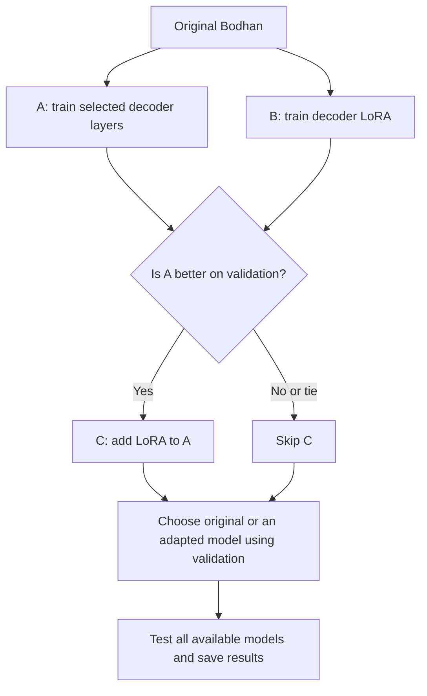

# Marathi ASR with Bodhan

Fine-tune **Bodhan Indic-Transcribe Core** using Marathi audio and transcripts from **Google FLEURS**.

This file explains how to run the project. [APPROACH.md](APPROACH.md) explains the ideas and a little maths.

## How to read the code

Start with `scripts/run_pipeline.py`, then follow these files in `src/marathi_asr/`:

1. `experiments.py` — the order of A, B, optional C, and evaluation.
2. `data.py` — prepare recordings and check the splits.
3. `model.py` and `lora.py` — choose which weights learn.
4. `train.py` — train, choose a checkpoint, and save the model.
5. `evaluate.py` and `metrics.py` — generate transcripts and count errors.

`tests/` checks these steps. The retained `models/`, `data/`, and `.venv-mac/` folders support local runs; they are excluded from the source archive.

## What we try

The full encoder stays frozen in every approach. We do not remove layers or quantize weights.

| Approach | Start from | Train |
|---|---|---|
| A | Original Bodhan model | Last two decoder layers and final normalization |
| B | Original Bodhan model | LoRA adapters across all decoder attention layers |
| C, optional | A's best model | New decoder LoRA adapters; freeze A's weights |

Run C only if **A has lower validation word error rate (WER) than B**. Skip C on a tie.



**Training data teaches. Validation data chooses. Test data measures the final result.** Test scores never decide whether C runs or which model is selected.

A and B change different parts of the decoder. C gets extra training. This is a practical comparison; it cannot prove that LoRA alone caused a difference.

## Run

Use **Python 3.10-3.12** and run commands from this folder.

**NVIDIA PC:** use Linux or WSL2 with a working NVIDIA driver.

```bash
bash scripts/bootstrap_gpu.sh
source .venv-gpu/bin/activate
```

**Apple Silicon:**

```bash
bash scripts/bootstrap_mac.sh
source .venv-mac/bin/activate
```

On a Mac, set `training.accelerator` to `"mps"` in [configs/marathi.json](configs/marathi.json). The default is `"cuda"`.

Accept access on the [Bodhan model page](https://huggingface.co/bodhan-ai/indic-transcribe-core). If `.env` is missing, copy `.env.example` to `.env`. Add your read token there:

```dotenv
HF_TOKEN=your_read_token
```

Keep `.env` private. Then run:

```bash
python -m pytest -q
python scripts/run_pipeline.py --config configs/marathi.json
```

This prepares data, trains A and B, runs C if needed, evaluates the saved models, and writes the comparison. Allow tens of gigabytes of free disk space for checkpoints. Actual memory use and runtime depend on the machine.

## Default experiment

- **Data:** 512 training clips (1.74 hours), 64 validation clips, 128 test clips.
- **Training:** 200 optimizer steps per stage, learning rate `1e-5`, batch size 1, accumulation 8.
- **LoRA:** rank 8, alpha 16, dropout 0.05.

Change these in `configs/marathi.json`. The code checks audio and split overlap and converts recordings to 16 kHz mono.

For another run, change `experiment.directory` to a fresh folder. The full comparison does not automatically resume. If changing the dataset settings, also use a fresh `data.directory`. On another PC, let the pipeline prepare its own data paths.

## Results and sharing

Open **`runs/comparison/comparison.md`** after the run. It shows WER, character error rate, training time, and the model selected using validation.

Each approach saves its model, settings, logs and predictions. LoRA runs also save small adapter files. C's adapters require A's checkpoint. The complete `model.nemo` has the adapters merged and can be loaded normally.

```bash
marathi-asr bundle-source
marathi-asr package-experiment
```

Both archives go into `dist/`. Share source through GitHub and completed run outputs through Google Drive. The source archive excludes secrets, data and model weights. Packaging run outputs requires a completed comparison.

`.gitignore` allows only project source, tests, the main config, and public documentation. Other files stay local by default. Add any new public folders to that list deliberately; keep real tokens only in the ignored `.env` file.

## Current status

**73 tests passed**, including checks with NeMo's decoder. The full A/B/C Bodhan comparison has **not** been run. No accuracy improvement is claimed.

This small read-speech dataset does not represent every Marathi accent or recording condition. Speaker separation and overlap with pretraining data are not independently verified.

## Sources

- [Bodhan Core](https://huggingface.co/bodhan-ai/indic-transcribe-core): model and tokenizer.
- [FLEURS](https://huggingface.co/datasets/google/fleurs): Marathi data. Keep its CC BY 4.0 attribution and Bodhan's model license.
- [NeMo](https://github.com/NVIDIA-NeMo/Speech/blob/v2.7.3/nemo/collections/asr/models/aed_multitask_models.py): training and export.
- [LoRA](https://arxiv.org/abs/2106.09685): adapter method.
- [SLAM-ASR paper](https://arxiv.org/html/2603.27981v1): motivation, not proof that this approach works best for Bodhan.
